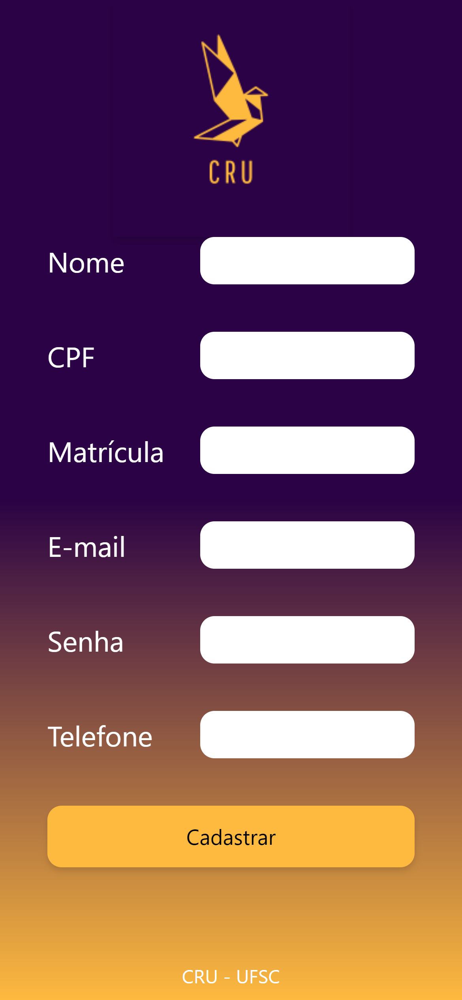
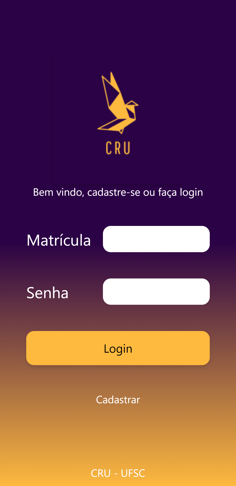
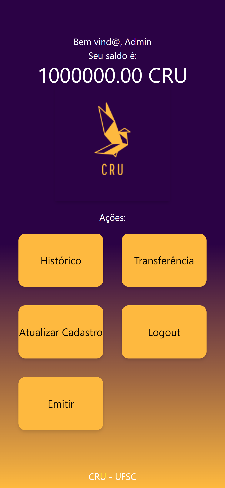
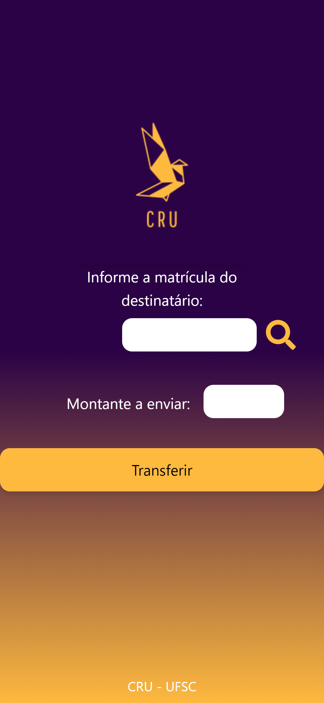
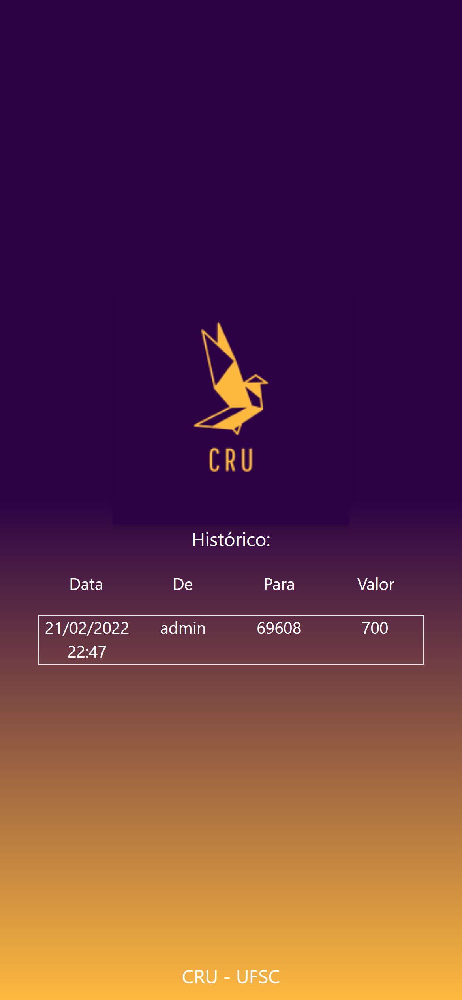

# CRU (English)
## Objective
The purpose of the application is to provide UFSC students and other recipients of government assistance programs with a more convenient and monitored way of accessing their funds. The recipients receive their monetary assistance through the blockchain, where transactions are easily auditable and trackable, and they may interact with it using the web interface.
## Structure
The web application has the task of serving as an interface to the blockchain which stores the information in secure and irrefutable manner. This application has the differential of using a blockchain to guarantee the irrefutability of transactions, greater security and the distribution of data across multiple nodes. In addition, the blockchain being used is classified as permissioned, our users will have to authenticate themselves in order to participate in the network.
## Functionalities
The main functionality of any financial application is the sending of funds between participants. In this application, in addition to sending resources, the user will be allowed to: consult their registration, consult the history, log in (to create the portfolios), update their credentials, and generate new tokens if they of the correct organization.

## Application screens
To perform a preliminary modeling of the web application, we used the figma tool. Below is the link to the developed modeling, with two window sizes for one of the proposal screens: https://www.figma.com/file/iLeOZas2U7iNjRn2tN52z9/CRU?node-id=5%3A65 

# CRU (Portuguese)
## Objetivo
O objetivo da aplicação é fornecer aos estudantes da UFSC e outros contemplados uma maneira mais conveniente e monitorada de acesso a programas de auxílio à permanência estudantil, tais como o PNAES. Os beneficiários receberão o auxílio por meio da blockchain, onde as transações serão facilmente rastreadas, e poderão interagir com os recursos por meio da aplicação web.
## Estrutura
A aplicação web, portanto, tem por objetivo servir de interface para a blockchain que servirá de banco de dados (distribuído) para armazenar de maneira segura e irrefutável as transações. Esta aplicação possui o diferencial de utilizar uma blockchain para garantir a irrefutabilidade das transações, a maior segurança e a distribuição dos dados em vários nodos. Além disso, a blockchain utilizada é classificada como permissioned, ou seja, usuários terão que se autenticar para poder participar da rede.
## Funcionalidades
A principal funcionalidade de qualquer aplicação financeira é o envio de recursos entre os participantes. Nesta aplicação, além do envio de recursos, será permitido ao usuário: consultar seu saldo, consultar o histórico e realizar cadastro e login (para criação das carteiras).

## Telas da aplicação
Para realizar a modelagem preliminar da aplicação web utilizamos a ferramenta figma. A seguir o liame à modelagem desenvolvida, com dois tamanhos de janela para da uma das telas propostas: https://www.figma.com/file/iLeOZas2U7iNjRn2tN52z9/CRU?node-id=5%3A65


# Installation

### **Attention! All scripts assume you are running them from the project source folder "/cru"**

#### 1. Clone this repository on your HOME (```~/CRU```)

#### 2. Make sure you are on the root of the project, then:

#### 2.1 run

    bash install_everything.sh

#### 2.2 then

    bash run_network.sh

#### 2.3 then

    bash start_server.sh

#### 2.4 then

    bash start_client.sh

#### 2.5 And you're done. 
# Dependencies
This project requires minifabric, node and docker. The install_everything script will download and install everything for you.


## Some Interface captures (Mobile)

<p float="left">





</p>
